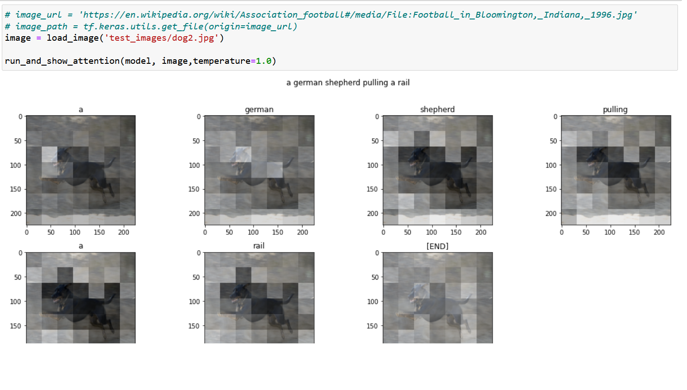
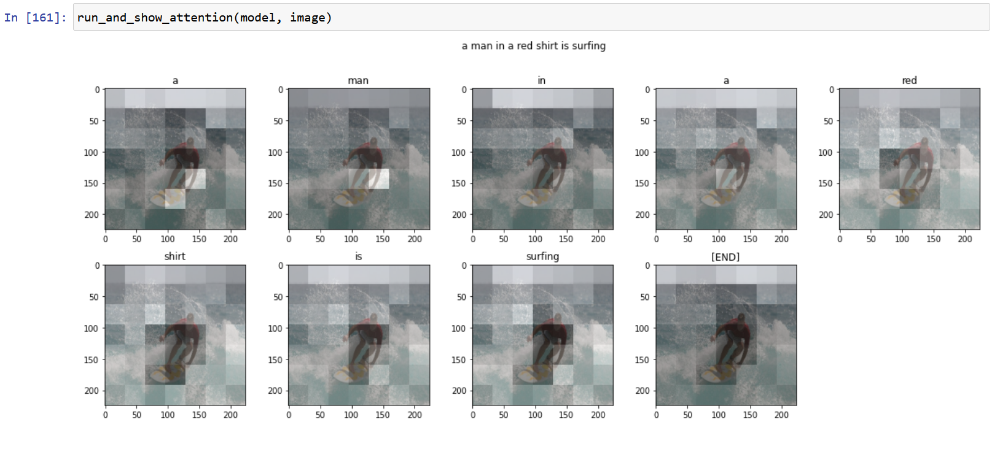

# Image Captioning using Transformer 

**Image Captioning**: This technique generates textual descriptions for images. Image Captioning falls under the domain of `vision-language` tasks, making it particularly challenging. 

In this tutorial, we employ the `Transformer` architecture for this task. We've utilized the [`flickr8k`](https://www.kaggle.com/datasets/adityajn105/flickr8k) dataset for our experiments. This dataset was chosen due to its compact size, and notably, each image is accompanied by 5 descriptive labels. 

This tutorial is inspired by the `TensorFlow Tutorial Documentation`. The entire procedure is explained in detail in [image_captioning_with_transformer.ipynb](image_captioning_with_transformer.ipynb). 

## Demo

Note: **The generated captions may not be highly accurate, as the model was trained on a smaller dataset.**

## Future Work

Our next step is to train our model for `Video Captioning`.
